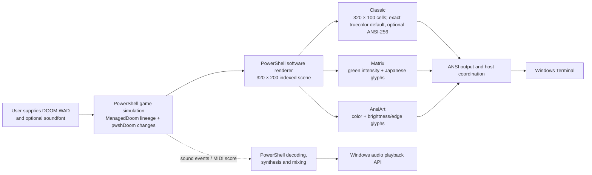

# Doom in PowerShell: how far can a terminal go?

Research article draft · Updated 2026-10-02. [Preview.6](https://github.com/jasonulbright/pwshDoom/releases/tag/v0.1.0-preview.6), pinned to candidate source `05556ee`, carries the current playable renderer candidate: an ABBA headless E1M2 profile reports a −2.88% median total-render change for PowerShell wall-band preselection. All36 maps pass smoke; Classic, Matrix and AnsiArt retain exact serial/worker parity at five E1M1 headings. These checks do not navigate or finish maps. The complete human Episode 1 route, independent original-framebuffer parity and broader Ultimate Doom release gates remain pending. See the [Preview.6 scope](release-preview6.md), [wall-band trial](../results/wall-band-preselection-trial-20261002.json), and [renderer integration evidence](../results/wall-band-renderer-integration-20261002.json). The earlier [Preview.5 scope and publication receipt](release-preview5.md) retain historical package evidence.

Post-preview work also exposes the cost of repeatedly rebuilding static render resources. Three interleaved stage cycles reduce map-resource preparation from 4.09–4.90 seconds to 81–112 ms, and verified-body reuse reduces isolated worker read-back to 69–81 ms. Those isolated improvements do not predict the complete handoff: three live Classic/audio routes measure 1.54–2.03 seconds. One run slows badly during E1M2, with synchronous terminal output averaging 85.8 ms per call while the host also admits simulation commands. A bounded asynchronous output experiment improves p99 simulation lateness in one ABBA cycle, but its 54.1–54.9 display events/sec still miss the 59-event threshold and its 60–65 ms p99 lateness still exceeds the 57.2 ms limit. Strips remains the default; three paired cycles and broader workloads remain required. See the [performance record](performance.md), which separates byte delivery, ETW presentation events and unverified optical frame identity.

A later three-cycle live comparison holds AsyncBatch fixed and varies only the exact-color encoder. ColorState reduces median observed bytes per frame by 14.73% and lifts the median global display-event rate from 51.668 to 53.750/sec. The per-cycle advantages are 2.39%, 8.86% and 0.03%; the last is effectively tied and includes a slower ColorState run. Every run consumes all input and returns all submitted audio, but none passes all numerical pacing gates. Maximum display gaps remain 1.24–2.92 seconds. The [twelve-run evidence](performance.md#three-live-exact-color-abba-cycles--october-1-2026) supports an optional encoder for this workload, while preserving Pairs/Strips defaults and the failed measurements. R19 is now a checked local development package; it does not close the human campaign, acoustic, original-executable fidelity or optical frame-identity gates.

## The question

Could PowerShell run Doom's game logic and draw its world inside Windows Terminal? The experiment uses a 320×200 Doom image, preserves the game's 35-tic simulation, and targets 60 displayed updates per second. A second goal grew out of it: turn the same world into a green Matrix view with Japanese characters, plus a full-color character-art mode.

The answer is a qualified yes. A real Doom-derived game foundation, renderer, gameplay loop, terminal encoders and audio algorithms now run in PowerShell. Preview.4 freshly passes the 36-map load/idle/render sweep under PowerShell 7.6.6. Focused tests cover campaign transitions, menus, saves, boss progression and all three display styles. That is meaningful engine work, but it is not proof that a human can finish every map. The one continuous Episode 1 playthrough, including its secret-map detour and finale, remains the current human test.

## What runs where

PowerShell owns the game and presentation algorithms. Windows Terminal receives their text output and presents it. Its GPU can compose and draw the terminal surface; it does not automatically execute PowerShell's collision, enemy logic, rasterization or ANSI encoding on the GPU. The operating-system and audio APIs provide host services around those algorithms.

The gameplay foundation is an attributed GPL PowerShell translation of ManagedDoom, itself derived from Doom. pwshDoom retains that lineage and adds integration, fixes and a terminal renderer; it is not a clean-room reimplementation. The source history and adopted changes are listed in [`ORIGIN.md`](../src/ManagedDoom/ORIGIN.md).

The three styles trade pixel detail for different looks. Classic uses one terminal cell for two vertically stacked pixels, so its 320×200 image occupies 320 columns by 100 rows. Matrix and AnsiArt reduce that same scene to a 160×50 character field: Matrix maps brightness to green tones, Japanese glyphs and moving highlights; AnsiArt uses color and edge/brightness choices. These modes are intentionally lossy. The project keeps Classic as the visual-fidelity reference.

## Several clocks, not one FPS

The game advances at 35 tics per second. Rendering workers produce images; the host writes ANSI data; Windows Terminal processes those writes; Windows may then present images to the display. A counter at one stage does not establish the rate at a later stage. In particular, a completed console write is not proof that a distinct frame reached the monitor.

The strongest available readings are still workload-specific:

| Run | Observed result | What it does not establish |
| --- | --- | --- |
| 28-second Classic E1M1 host run, with sound effects and music | 34.959 simulation tics/sec; 59.670 completed Terminal updates/sec | The updates were not measured as distinct monitor presentations. One queue-starvation observation occurred after the final music packet; no listener review was made. See [`performance.md`](performance.md#current-source-e1m1-run--september-26-2026). |
| Maximized Classic E1M1 PresentMon sample, no audio | 34.977 active tics/sec; 47.73 display transitions/sec | It was one unpaired replay, ended on E1M1 rather than a completed route, and included a 7.119-second same-map asset reload. It does not certify the target. See [the current pacing record](performance.md). |
| 120-second headless E1M1 host run, with full-catalog music | 34.991 simulation tics/sec; 48.258 completed host updates/sec; all 5,290,740 audio frames returned after crossing the 96-second music loop boundary | Headless host updates are not Terminal or monitor measurements. One mixer block exceeded the packet interval; no active-run queue starvation or audible review was observed. See [`performance.md`](performance.md#two-minute-audio-loaded-headless-e1m1-run--september-28-2026). |
| R16 four-second E1M1 headless run, actual audio device and qualified Episode 1 catalog | 34.728 simulation tics/sec; 36.727 headless render updates/sec; all 186,480 submitted audio frames completed, including 3,780 drained in 68.8 ms at shutdown | No audio/device/cleanup errors, software queue-starvation observations, rebuffering, or canceled frames. A short headless startup/exit check is not sustained audible continuity, Terminal pacing, or displayed FPS. See the [R16 receipt](../results/episode1-current-human-candidate-20260929-r16.json). |
| R17 four-second packaged E1M1 check, actual audio device and Episode 1 catalog | 34.741 simulation tics/sec; 42.489 completed headless updates/sec; all 175,140 submitted music frames returned | One queue-starvation poll followed the final packet, with no rebuffer resume. This is not displayed FPS or sustained audio qualification. See the [R17 package receipt](../results/r17-playtest-package-validation-20260929.json). |
| R17 five-second idle E1M1 host, two workers | 34.793 simulation tics/sec; 81 headless frames in total; one automap traversal and 174 cache hits | Headless frames are not Terminal writes or displayed frames. The idle run is not a moving-view or campaign test. See the [R17 candidate receipt](../results/episode1-current-human-candidate-20260929-r17.json). |
| R17 current-source renderer profile, fixed E1M1 view | Across 480 sequential stripe samples, median render work was 8.364 ms per stripe; geometry accounted for 6.935 ms | The stripes ran sequentially in one process. This identifies geometry as the next code-optimization target but does not measure process concurrency, host pacing, Terminal output or displayed FPS. See the [R17 profile receipt](../results/r17-fast-renderer-phases-20260929.json). |
| R16 six-second E1M1 headless run with the 30-entry full-campaign catalog | 34.810 simulation tics/sec; 23.818 headless render updates/sec; all 265,860 submitted audio frames completed | The worker played D_E1M1 only; this does not verify runtime playback of every catalog track, full-campaign continuity, audibility, Terminal output, or display rate. See the [full-catalog receipt](../results/music-campaign-catalog-host-r16-20260929.json). |
| One fixed framebuffer encoded as Classic `Pairs` versus optional `Ansi256` | 666,169 versus 475,310 bytes across 16 strips; ANSI-256 used 28.65% fewer bytes | This compares output volume for identical indexed pixels; ANSI-256 approximates RGB. It is not an encoder-speed or live-pacing result. The one-per-mode live runs were unpaired and inconclusive. See the [Ansi256 receipt](../results/ansi256-runtime-20260929.json). |
| E3M6 headless, full-catalog runtime check | Two 30-second runs reached 33.50 / 34.93 tics/sec on PowerShell 7.6.5 and 27.63 / 28.37 on 7.6.6; a 120-second 7.6.5 run reached 34.37 | The 7.6.6 result is lower in these repeats, but they do not prove the runtime patch caused the difference. Headless host updates are not monitor presentations, and queue polling is not an audible-dropout test. See [the full comparison](performance.md#powershell-runtime-comparison-on-e3m6--september-28-2026). |
| R9 music-catalog open, eleven Episode 1 tracks | Warm-cache reader-open median: 4.665 seconds serial, 2.050 seconds with up to four PowerShell runspaces; all qualification hashes match and 21 focused checks pass | Measures reader initialization only, after the OS file cache is warm; the separate five-second host run is unpaired and does not measure visible playback. See [the R9 measurement](performance.md#open-the-qualified-episode-1-music-catalog-in-parallel--september-29-2026). |
| Fixed 1,200-command E1M3 headless prefix | 30.829 tics/sec; 53.925 completed images/sec; all submitted audio frames returned | Headless image completion is not a display measurement or human playthrough. See [automap performance](automap-discovery-performance.md). |

The machine approaches Doom's 35-tic simulation rate in some runs, but the E3M6 full-catalog repeats vary materially with the recorded PowerShell runtime version. The evidence does not establish why, and no run proves 60 distinct displayed frames/sec. The combined 35-tic/60-display target remains unverified. These runs are not a controlled comparison against another engine.

The October 1 audio-loaded Classic route repeats show why averages alone are insufficient. Two sequential E1M1-to-E1M2 runs use identical source and runtime but reach 34.969 versus 27.676 active tics/sec and 50.849 versus 31.137 global Terminal display transitions/sec. Both complete the same 1,747 commands and return every submitted audio frame. Their map handoffs take roughly 6.8 and 9.1 seconds between observed screen spans; sampled game private memory reaches about 5.44 GiB. A separate exploratory run is retained, including its overlap with a frame export. None passes the frozen pacing thresholds, and the data does not yet isolate the slowdown's cause. The [repeated-route measurement](performance.md#loaded-classic-route-repeats--october-1-2026) keeps the full intervals, p99 gaps, startup, CPU/memory boundaries and raw hashes visible.

## A room is not a campaign

The all-map sweep loads each of the 36 Ultimate Doom maps, advances a short simulation, and renders frames. Preview.4 repeats that sweep on its packaged implementation source. Separate HMP input routes complete E1M1–E1M4 through ordinary exits; transition tests cover the E1M3 secret path, return to E1M4, map-8 boss triggers and finale states. These checks find structural defects quickly, but none substitute for ordinary play across a complete episode.

The R17 human route is:

`E1M1 → E1M2 → E1M3 → E1M9 → E1M4 → E1M5 → E1M6 → E1M7 → E1M8 → Episode 1 finale`

It is intended to cover continuous keyboard play, inventory and map transitions, the secret return, the boss-triggered exit, visible presentation, and sound during a real run. The exact package, controls and finish point are in the [playtest handoff](episode1-playtest.md). The old automated E1M5 continuation ended in player death without exposing a reproducible engine defect; the route was not tuned into a speedrun. The E1M2 chainsaw crash was traced to an unsupported angle comparison; the focused attack regression reaches and damages an imp, but Jason has not completed the post-fix full route. The lower-level Techpillar overlap is consistent with classic plane/sprite draw order; the separate pre-placed Gibs-through-wall angle remains unreproduced. The human run is still pending.

Menus, pause, six save slots, load/overwrite confirmations, automap and intermission/finale transitions have focused coverage. Five boss-trigger behaviors pass 97 checks, but trigger correctness is not evidence that ordinary combat reaches those triggers. The distinction between feature tests, route replays and human campaign evidence is retained in the [campaign matrix](campaign-matrix.md).

## Fidelity work has boundaries

The renderer is a substantial PowerShell implementation, not yet an original-executable pixel match. It now follows Doom-style fixed-point plane mapping, integer wall sampling, sprite/weapon patch projection, sector lighting, palette changes and the major HUD layout. One reproduced wall-silhouette leak was clipped; the focused test suppresses the candidate-only BON1 actor pixels at its failing view. A more recent E1M1 screenshot of lower-level Techpillar columns crossing an upper floor was traced to Doom's plane/sprite draw order. Sanglard's discussion of visplanes and masked sprites (pp. 197, 208, 214, 240 and 242) describes the relevant ordering and wall-silhouette clipping; the [reference audit](reference-audit.md) cross-checks that model against the ported renderer. A historical 17-pixel actor-mask difference at E1M1 tic 105 no longer reproduces in the current-source eight-state regression comparison. A later 64-case sweep of the two pre-placed Gibs piles across the two recorded pool camera states found one candidate-only mask pixel; detailed palette and plane data explain it as a background-color disagreement, not a reproduced through-wall leak. The exact angle Jason saw and independent original-executable parity remain unverified ([sweep](../results/episode1-pool-gibs-angle-sweep-20260928.json)).

The adopted PowerShell reference was itself corrected after source inspection found object-equality behavior that skipped Doom's wall-orientation lighting. Comparisons against that reference have improved specific HUD, lighting and projection cases, but broad scene differences remain. The latest eight-state E1M1 actor comparison reports four candidate-only mask-edge pixels at tic 35 and none from tics 70 through 280; that replay does not reproduce the reported Gibs-through-wall view. A separate input-tic-140 audit found 13 reference-only `BON2B0` mask pixels at a column where pwshDoom's recorded background depth is 277 map units nearer than the sprite. This accounts for one narrow comparison difference, not the reported view or original-executable parity ([depth audit](../results/actor-occlusion-depth-audit-human-prefix-tic140-20260928.json)). No independent original Doom executable has been used for a full visual comparison. See the [rendering record](rendering-fidelity.md) for the individual controls and limitations.

## Sound is part of the test

Sound effects are decoded and mixed in PowerShell; Windows APIs handle playback. Music is also synthesized and mixed in PowerShell from the user's IWAD and soundfont. Eleven Episode 1 tracks have local loop qualifications. The full 30-entry Ultimate Doom catalog covers the 27 map-track names, intermission, the Episode 1 finale, and the E3 Bunny finale; actual map-selection callbacks and finale transitions pass 126 checks. On September 28, a 120-second headless E1M1 session crossed its music-loop boundary and returned all 5.29 million audio frames. R16 drains already-submitted Windows audio buffers for up to 250 ms on normal unpaused shutdown. In the R17 packaged four-second E1M1 run, the worker selected D_E1M1 and returned all 175,140 submitted frames, then closed without errors; one queue-starvation observation followed the final packet, with no rebuffer resume. A separate six-second run with the 30-entry catalog completed all 265,860 submitted frames, but selected only D_E1M1. The current reader also passes [15 save/load/new-game audio-worker checks](../results/episode1-save-worker-reader-optimized-20260928.json). Neither WADs nor soundfonts are included in the source package.

The music work proves useful but bounded facts. A loop can be checked through repeated PCM output or a complete normalized synthesizer-state recurrence. Short audio-device checks verify selection and shutdown, not that an entire episode plays without a dropout or sounds good to a listener. All nine Episode 2 and all nine Episode 3 map-track names are qualified; D_BUNNY also has a complete-state loop proof, and finite D_INTRO and D_INTROA scores have reader qualifications. Episode 4 reuses earlier episode tracks. A two-minute E1M1 run crossed one loop seam; one post-final-packet queue observation followed shutdown. Earlier loaded E3M6 trials exposed active software queue starvation. After the PowerShell output-clock fill change, a current-source, 30-second, 16-worker E3M6 run with the 30-track catalog mixed 720 simulation packets plus 104 output-clock blocks with no reported queue-starvation or rebuffer observations, then closed the audio device cleanly. At shutdown, 5,040 of 1,038,240 submitted frames remained in the canceled-tail upper bound. The run also spent 6.769 seconds paused for a same-map reload whose trigger was not isolated, and its active simulation rate was 30.93 tics/sec. This improves the bounded queue evidence; it does not establish uninterrupted audible output, physical-device underrun behavior, acoustic quality, or full-campaign continuity. A listening review and full-campaign audio qualification remain open. Details are in the [music qualification notes](music-preparation.md) and [current E3M6 load receipt](../results/e3m6-realtime-audio-loaded-20260928.json).

## Existing alternatives

“Doom in a terminal” is no longer novel by itself, and the relevant projects take different paths. The [updated survey](existing-implementations.md) was checked against current repository sources on September 28, 2026.

| Project | What it optimizes for | Relationship to this project |
| --- | --- | --- |
| [ManagedDoomPowershell](https://github.com/oleyska/ManagedDoomPowershell) | PowerShell gameplay with a Silk.NET/OpenGL window | Important engine lineage, but not a terminal renderer. Its maintainer reports poor Windows performance and documents known transition/frame-cap limitations. |
| [doom-powershell](https://github.com/nick0451/doom-powershell) | A compact, single-file PowerShell WAD renderer and game | A closer language/display comparison. Its README still lists moving floors, walk-over triggers and sound as unfinished. We have not benchmarked its current source. |
| [terminal-doom-pwsh](https://github.com/spidychoipro/terminal-doom-pwsh) | Original Doom engine in Windows Terminal | PowerShell builds and launches it, but the gameplay and half-block renderer are compiled C. It is outside the all-algorithms-in-PowerShell constraint. |
| [cryptocode/terminal-doom](https://github.com/cryptocode/terminal-doom) | Original graphics and sound in modern terminals | C `doomgeneric` plus a Zig/`libvaxis` frontend and Kitty graphics. Its README reports macOS/Linux testing and says Windows compiles without a compatible local terminal. It is not benchmarked here. |
| [dcouple/terminal-doom](https://github.com/dcouple/terminal-doom) | Shareware Doom in Kitty-protocol terminals | Chocolate Doom in WebAssembly through a local browser; the README targets macOS/Linux, has sound effects but no music, and keeps saves in the session. |

For the narrow requirement “real Doom-derived gameplay in Windows Terminal, with gameplay/rendering/audio algorithms kept in PowerShell,” pwshDoom is the closest complete implementation found in this survey. That makes it the best fit to this experiment's constraint, not the best Doom port overall. The native ports choose compiled engines and protocols that can carry original pixels more directly; they are the sensible choice when broad compatibility, speed or pixel fidelity matters more than keeping algorithms in PowerShell. No equal-workload comparison has established a universal winner.

## What a preview does and does not claim

The current public package is [Preview.4](https://github.com/jasonulbright/pwshDoom/releases/tag/v0.1.0-preview.4), with 544 manifest-verified payload files and a matching fresh public download. The local R20 handoff adds readable notices, resource reuse, optional asynchronous output, loading feedback and realtime audio recovery. Its [receipt](../results/r20-playtest-package-validation-20261002.json) pins 557 payload files and extracted menu/save/worker/audio checks. R19 and earlier archives remain comparison builds. This development archive is separate from a tagged release; full campaign and performance gates stay open.

Later map-handoff profiling identifies repeated WAD-resource conversion and serialization as a concrete cost. Three paired ABBA stage cycles reduce preparation from 4.09–4.90 seconds to 81–112 ms by retaining immutable resource data, with identical direct/read-back frame hashes. Initial cache construction still costs about five seconds and retains 35.87 MiB; each map gets private geometry and raster scratch. A complete live audio route then measures a 102 ms preparation stage but still a 4.517-second total load, with worker-side deserialization remaining. This demonstrates a specific optimization under the PowerShell constraint; it does not establish 60 displayed game frames/sec. [Stage and worker evidence](../results/map-render-resource-cache-20261001.json), [live timing](../results/resource-cache-loaded-classic-20261001-r1.json).

Verified resource-body reuse in persistent workers subsequently reduces isolated read-back from 1.30–1.51 seconds to 69–81 ms. Three live Classic/audio routes measure 1.54–2.03-second map loads, clean software audio and 4.47–4.60 GiB sampled private memory. Their 55.18 / 53.75 / 47.43 Terminal display transitions/sec still miss the release gate, and the last run falls to 30.66 simulation tics/sec. Its E1M2 output calls average 85.8 ms while the same host supplies game commands. This exposes a remaining coupling between terminal stalls and gameplay; it does not establish their cause or a 60-frame solution. [Three-run evidence](../results/reader-cache-loaded-classic-20261001.json).

Loading feedback then exposes another boundary cost. In three clean repeats,
the first asynchronous banner write stays pending for about 983 ms. Redirecting
renderer logs within PowerShell removes thirty-two idle host pipe-reader Tasks;
three corresponding first-write completion bounds fall below 2.72 ms, and
startup falls from 40–43 seconds to about 27. This targeted result still leaves
50.5–52.4 global Terminal display events/sec and 624–921 ms p99 tic lateness.
It also exposes 662–872 ms median audio packet age despite zero software
starvation observations. A responsive loading banner, a healthy queue counter
and a playable route each establish different capabilities. The [clean measurements](../results/renderer-file-logs-pacing-classic-20261002.json)
and [actual recorded handoff](../results/renderer-file-logs-live-20261002.json)
retain those distinctions; neither qualifies the full release.

A controlled audio experiment subsequently shows why zero starvation was
insufficient: a700 ms producer gap leaves about712 ms of packet delay even
after input resumes. Realtime filler kept playing, then caught-up packets added
the same duration again. Accounting for those intervals while applying controls
on the current output clock lowers controlled recovery maxima below30 ms.
Three loaded routes have65–85 ms median processing ages and no producer
backpressure. Late emitter updates can coalesce and cannot reconstruct past
sounds; acoustic latency remains unmeasured. Display rates stay52.6–53.8/sec,
with substantial early tic stalls. The [controlled proof](../results/audio-realtime-recovery-20261002.json)
and [loaded evidence](../results/audio-recovery-loaded-classic-20261002.json)
support this specific recovery behavior without closing the wider gates.

Command tracing then distinguishes a late producer from a slow simulation
worker: one command is published789 ms late with an empty observed queue, and
its update starts about0.28 ms later. A bounded catch-up loop preserves all
commands and exact control boundaries, but three clean repeats remain uneven:
p99 tic lateness is106 /647 /79 ms and Terminal display events48.9 /48.7 /50.4
per second. The outlier again overlaps synchronous output stalls. This is a
useful scheduling correction with retained compatibility evidence, rather
than proof that the performance target is met. [Diagnostic](../results/command-publication-stall-diagnostic-20261002.json),
[repeated measurements](../results/command-burst-loaded-classic-20261002.json).

Three paired output-mode cycles then lower median p99 tic lateness with the
bounded asynchronous option in every cycle, but display-event changes vary
from−1.65% to+3.47%. None of twelve runs meets all numerical checks. One
1.576-second display-event gap contains96 completed game writes and94 dropped
presents, with no loading UI in that interval. A console-write counter alone
would conceal that failure. The experiment retains startup, CPU, memory,
audio accounting and whole-window outliers, while keeping the option distinct
from the default. [Paired evidence and diagnostic limits](../results/command-output-abba-classic-20261002.json).

The public Preview.5 community-test package is source-inclusive and excludes the IWAD, soundfont, compiled engine, tools, recordings and research PDF. A fresh public download matches the tested ZIP and its separate checksum; all 559 payload hashes pass. Its manifest pins preparation commit 1681532, while release tag 56e132a adds validation. All 478 runtime payloads also match that tag after checkout newline normalization. Publication occurred on the 35th commit after Preview.4, following the requested cadence. [Publication evidence](../results/preview5-publication-20261002.json).

The extracted Preview.5 checks retain all 206 adopted GPL PowerShell sources and their attribution, recognize 36 maps, and exercise menus, save/load, audio recovery and persistent workers in all three modes. Each actual save/control fixture retains 350 commands and eleven checkpoints. Map-start smoke and synthetic controls do not finish campaigns; digital audio completion does not establish sound reaching the speaker. Retained live footage differs from the package in one opt-in profiler source, with default image/strip equivalence verified separately. [Package evidence and limits](../results/preview5-package-validation-20261002.json). The complete human E1 route, independent moving-world fidelity, sustained pacing, physical/acoustic review and second hardware remain open. The paper still needs those results and publication-ready illustrations; Doom II and MyHouse remain later scopes.

The current evidence supports a specific conclusion: PowerShell can run a real Doom-derived single-player engine and render it in Windows Terminal, including an intentionally stylized Japanese-glyph Matrix view and color art. The experiment has exposed where the shell/runtime/terminal boundary costs time, how character encodings trade detail for bandwidth, and how much campaign coverage matters beyond a pretty frame. Whether it can deliver the full Ultimate Doom experience at its target pace is still being tested.

### Evidence and reproduction

- [Roadmap and current release gates](roadmap.md)
- [Episode 1 handoff and scope](episode1-playtest.md)
- [Existing implementation survey](existing-implementations.md)
- [Terminal architecture](terminal-architecture.md)
- [Performance evidence](performance.md)
- [Campaign matrix](campaign-matrix.md)
- [Rendering fidelity](rendering-fidelity.md)
- [Audio and music preparation](music-preparation.md)
- [Source lineage and modifications](../src/ManagedDoom/ORIGIN.md)

Independent comparison now includes an observed original DOS executable paused
at an authored315-command prefix. The preparation decodes every command and
repeats the PowerShell candidate's indexed image. The retained original image
is a lossy window screenshot; raw framebuffer and hidden-state parity remain
unqualified. Original Doom's configuration rewrite is recorded separately from
unchanged demo/image hashes. [Evidence and capture limits](../results/original-doom-frozen-fixture-20261002.json).

The next frame-cost investigation distinguishes maps rather than treating one
average as an engine property. Retained live worker spans rise from about12–13 ms
in E1M1 to20–23 ms in E1M2. An opt-in fixed-state profile attributes the slowest
E1M2 stripe mainly to wall traversal/drawing. Named timers leave copying and
scheduling partly unclassified; they do not by themselves prove a speedup.
Exact image/strip checks support using these diagnostics to select the next
bounded optimization. [Attribution and boundaries](performance.md#attribute-live-frame-costs-and-split-geometry-profiling--october-2-2026).

Dense E3M6 subsequently fails the frozen pacing gates in all three modes despite
retaining every command/checkpoint/audio frame. A paired16-versus8-worker study
exposes a useful tradeoff: fewer workers raise simulation rate10–14% and reduce
sampled game CPU/memory, while display-event rate falls8–10%. Audio/music run
inside the sampled simulation process; the earlier separate-process inference
is explicitly corrected. [Dense workload and worker evidence](performance.md#eight-worker-tradeoff-in-dense-e3m6--october-2-2026).
Separate window/loopback recordings preserve the styles and pickup/damage
effects, while retaining missing startup coverage and small near-tail digital
capture gaps. They establish neither acoustic quality nor optical60 FPS.

Three snapshot arithmetic/lookup/index trials preserve exact bytes but produce
small or mixed gains and stay out of production. Complete command accounting
reveals a larger omitted stage: discovering automap lines costs about5–6 ms per
tic even when the automap is hidden. Removing that work would change gameplay
evidence; the next optimization must preserve complete mapped-line states.
[Stage accounting and rejected alternatives](../results/e3m6-command-stage-audit-20261002.json).

A subsequent exact-angle optimization replaces generic ref-based integer
division inside numeric discovery with a bounded floor calculation. Three
isolated ABBA cycles reduce256-call batch cost about55%, with20,900 angles,
20,509 quotients, mapped-line oracles and actual save/automap workers checked.
The [receipt](../results/discovery-slope-production-20261002.json) also retains
the failed harness and stale E1M3 input. Native pacing still needs a separate
committed-source measurement; method gains do not establish60 displayed FPS.

That measurement now retains all commands/checkpoints/audio but still fails
full pacing gates: median active rates32.7/31.2/31.9 tics/sec across
Classic/Matrix/color art, with42.3/46.8/43.3 display events/sec. The older
batch is unpaired, so its lower rates do not prove a causal live speedup.
[Full windows and source/accounting evidence](../results/discovery-slope-native-pacing-20261002.json).
Current effect recordings retain styles, HUD and pickup/damage behavior;
the external recorder failure and20ms active Matrix loopback coverage gap
remain explicit. [Media and acoustic limits](../results/discovery-slope-effects-live-20261002.json).

The review then exposes a fidelity defect that the older test missed: sprite
slope division still rounded fractional values and omitted unsigned overflow.
An ordinary-sized synthetic direction crosses to the wrong sprite rotation.
Integer table-direction tests passed because those quotients were integral;
fractional and wrapped-coordinate cases catch the mismatch. The corrected
PowerShell helper passes the expanded math and all-style worker checks.
[Reproduction, test blind spot and limits](../results/sprite-slope-correction-20261002.json).
This establishes the specific arithmetic correction, with independent moving
original-game frames still required for broader fidelity claims.

Separate recordings on the corrected build retain all three modes and source
pins, with no uncovered audio interval inside their gameplay-write windows.
Startup/post-game gaps and the prior-build Matrix gap remain explicit.
[Current recording coverage](../results/sprite-slope-effects-live-20261002.json).
Passing digital consistency still leaves acoustic continuity and independent
moving-world original-image comparisons unqualified.

Reference code needs qualification too. Three wall paths in the adapted
PowerShell comparator rounded a quotient that the pinned C# source floors.
Correcting them passes 60,066 independent scalar checks and changes some frozen
scene comparisons while leaving the candidate images unchanged. A higher mismatch
count after this correction describes a changed oracle, not a new product defect.
[Failed baseline, source pins and image controls](../results/reference-wall-inverse-scale-20261002.json).
Historical comparisons remain attributable to their original reference version.

Correctness also has a cost. Numbered texture rows expose the playable renderer's
continuous-distance wall sampling; quantized inverse scale fixes the isolated
texel error in solid and transparent walls. Production passes over 28 million
authored samples and preserves all three display modes in actual worker checks.
Real-map comparisons improve overall in E1M2 but worsen selected views, because
the broader projection and edge differences remain. Serial ABBA measurements
retain initial-call asymmetry and later dense cycles that are 4–6% slower.
The change is adopted for its demonstrated arithmetic correction, with a native
performance gain unqualified. [Evidence, alternatives and failures](../results/wall-vertical-sampling-20261002.json).

The changed renderer also runs in separate actual Classic, Matrix and color-art
recordings with unchanged source pins and complete replay/audio accounting.
Reviewed effect frames preserve the modes, HUD and notices. No uncovered digital
interval falls inside their gameplay-write windows; startup coverage and 15–26 ms
post-game gaps remain. This preserves the evidence for earlier capture failures
and leaves acoustic continuity and physical timing unqualified.
[Committed-build recording receipt](../results/wall-vertical-effects-live-20261002.json).

The remaining image error is partly attributable. A frozen-view diagnostic
preserves ordinary pixels/depth, then replaces selected wall texture parameters.
Reference scale alone reduces disagreement from 4,167 to 3,855 indices;
reconstructed horizontal texture coordinates reduce it to 2,302, and both to
1,951. Their effects interact, leaving substantial error. This selects the next
sampling change without treating a reference-derived override as production
compatibility or original-game proof. [Attribution and limitations](../results/wall-projection-attribution-20261002.json).

The next correction preserves WAD wall angles and quantizes horizontal texture
coordinates. All ten measured static views improve against the same reference
pixels; the frozen raised-ceiling view falls from 4,167 to 2,270 disagreements.
A worker test catches an integration mistake: the class-based trial depends on
engine classes that the separate render processes never load. Numeric PowerShell
math and transported tables fix that dependency, with exact returned parameter
and frame controls. Eleven extreme overflow cases remain explicit.
[Implementation, failures and measured limits](../results/wall-horizontal-sampling-20261002.json).

The adopted implementation preserves Classic, Matrix and color art in actual
worker comparisons. Later serial cycles cost 0.2–1.6% more than the old renderer
in this batch; the earlier alternatives' 4–17% increases remain recorded. Initial
calls and outliers are retained. Better wall sampling does not yet establish
original-game image parity, campaign completion or the native 35-tic/60-frame goals.

Live recordings on that committed build retain all three modes and their HUD,
pickup and damage effects. Digital audio accounting is complete, with capture
coverage through gameplay writes and explicit startup/post-game gaps. Separate
session checks preserve menus, automap and map resources across the existing
render processes, including failure propagation from a corrupt test asset.
[Effect recordings](../results/wall-u-effects-live-20261002.json) and
[reload controls](../results/wall-u-session-reload-20261002.json) add bounded
integration evidence; human campaign play, acoustics and native pacing remain
separate qualifications.

The changed build's native measurements still miss the target. Across three
repeats per mode, median active rates are about 32/32/32 tics/sec and display
transitions about 37/40/42 per second. Tic p99 lateness exceeds a second in every
run. Audio accounting remains complete, with zero software starvation/rebuffer;
startup stays under 31 seconds. The full windows, source checks, CPU/memory limits
and ended process identities remain recorded. These results preserve the
difference between better sampling arithmetic and a qualified playable performance
target. [Current measurements](../results/wall-u-native-pacing-20261002.json).

The next bottleneck profile found repeated general PowerShell method invocation
inside actor-state changes. Routing the 52 vanilla action names through a
same-name PowerShell switch lowered pooled headless update medians 10.02% across
two 420-command samples. Every recorded state and render hash matched at all 421
tic boundaries; campaign, boss, menu and save checks also pass. This local
improvement costs 1.01% more allocated bytes, and its 67.17 ms p99 remains above
the 57.2 ms proposed gate. The measurement omits renderer workers, Terminal and
audio, so it is a candidate for a clean live retest rather than a host-level
performance claim. The committed candidate also loads all 36 maps for 35 idle
tics and two serial rasterizations each. A user-owned Windows Terminal prevented
the isolated PresentMon retest from starting; the harness preserved the window
and the native pacing effect remains unknown. [Dispatch evidence and
alternatives](../results/mobj-action-dispatch-20261002.json), the [36-map
smoke receipt](../results/campaign-smoke-dispatch-20261002.json), and exact
serial/worker parity in five E1M1 views for Classic, Matrix and color art.
[Mode receipt](../results/mobj-action-render-modes-20261002.json) checks the
internal renderer and encoders; original-executable fidelity remains separate.

### Preview.6 package and performance update

Preview.6 followed 35 commits after Preview.5 and is now public. Its tested ZIP is 1,819,451 bytes and pins clean source commit 0145d75; extraction verified all 569 file hashes and the separate checksum asset. In the extracted build, all 36 maps pass 35 idle tics and each retained style matches serial rendering over five views and 320,000 pixels with 16 workers. A four-run fixed-view E1M2 ABBA experiment reduced median total renderer time by 2.88% and wall/BSP time by 5.03%, with exact pixels. This bounded renderer result is not a general frame-rate or full-host claim. [Preview.6 release scope](release-preview6.md), [package validation](../results/preview6-package-validation-20261002.json), and [publication verification](../results/preview6-publication-20261002.json) retain the source hashes and limits. The complete human Episode 1 route, moving-world original-renderer comparison, display pacing, physical/acoustic review and second hardware remain open.
