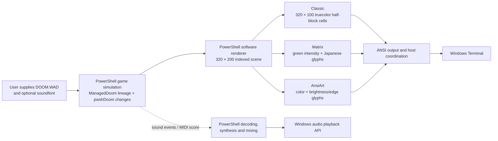
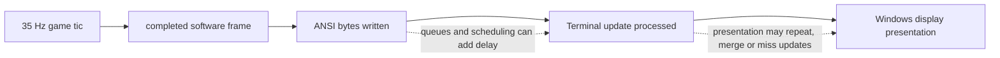

# Doom in PowerShell: how far can a terminal go?

Research article draft · Updated 2026-09-28. The Preview.3 package is still a local candidate. Jason's complete Episode 1 playthrough has not yet been reported, so this article describes measured progress rather than a finished campaign certification.

## The question

Could PowerShell run Doom's game logic and draw its world inside Windows Terminal? The experiment uses a 320×200 Doom image, preserves the game's 35-tic simulation, and targets 60 displayed updates per second. A second goal grew out of it: turn the same world into a green Matrix view with Japanese characters, plus a full-color character-art mode.

The answer is a qualified yes. A real Doom-derived game foundation, renderer, gameplay loop, terminal encoders and audio algorithms now run in PowerShell. The current source passes map-load and rendering smoke checks for all 36 Ultimate Doom maps, and it has focused tests for campaign transitions, menus, saves, boss progression and all three display styles. That is meaningful engine work, but it is not proof that a human can finish every map. The one continuous Episode 1 playthrough, including its secret-map detour and finale, remains the current human test.

## What runs where

PowerShell owns the game and presentation algorithms. Windows Terminal receives their text output and presents it. Its GPU can compose and draw the terminal surface; it does not automatically execute PowerShell's collision, enemy logic, rasterization or ANSI encoding on the GPU. The operating-system and audio APIs provide host services around those algorithms.

The gameplay foundation is an attributed GPL PowerShell translation of ManagedDoom, itself derived from Doom. pwshDoom retains that lineage and adds integration, fixes and a terminal renderer; it is not a clean-room reimplementation. The source history and adopted changes are listed in [`ORIGIN.md`](../src/ManagedDoom/ORIGIN.md).

The three styles trade pixel detail for different looks. Classic uses one terminal cell for two vertically stacked pixels, so its 320×200 image occupies 320 columns by 100 rows. Matrix and AnsiArt reduce that same scene to a 160×50 character field: Matrix maps brightness to green tones, Japanese glyphs and moving highlights; AnsiArt uses color and edge/brightness choices. These modes are intentionally lossy. The project keeps Classic as the visual-fidelity reference.

## Several clocks, not one FPS

The game advances at 35 tics per second. Rendering workers produce images; the host writes ANSI data; Windows Terminal processes those writes; Windows may then present images to the display. A counter at one stage does not establish the rate at a later stage. In particular, a completed console write is not proof that a distinct frame reached the monitor.

The strongest available readings are still workload-specific:

| Run | Observed result | What it does not establish |
| --- | --- | --- |
| 28-second Classic E1M1 host run, with sound effects and music | 34.959 simulation tics/sec; 59.670 completed Terminal updates/sec | The updates were not measured as distinct monitor presentations. One queue-starvation observation occurred after the final music packet; no listener review was made. See [`performance.md`](performance.md#current-source-e1m1-run--september-26-2026). |
| Maximized Classic E1M1 PresentMon sample, no audio | 34.977 active tics/sec; 47.73 display transitions/sec | It was one unpaired replay, ended on E1M1 rather than a completed route, and included a 7.119-second same-map asset reload. It does not certify the target. See [the current pacing record](performance.md). |
| Fixed 1,200-command E1M3 headless prefix | 30.829 tics/sec; 53.925 completed images/sec; all submitted audio frames returned | Headless image completion is not a display measurement or human playthrough. See [automap performance](automap-discovery-performance.md). |

Those observations put the machine near Doom's simulation rate in lighter tests, but the combined 35-tic/60-display target remains unverified. They are not a controlled comparison against another engine.

## A room is not a campaign

The all-map sweep loads each of the 36 Ultimate Doom maps, advances a short simulation, and renders frames. Separate HMP input routes complete E1M1–E1M4 through ordinary exits; transition tests cover the E1M3 secret path, return to E1M4, map-8 boss triggers and finale states. These checks find structural defects quickly, but none substitute for ordinary play across a complete episode.

The current human route is:

`E1M1 → E1M2 → E1M3 → E1M9 → E1M4 → E1M5 → E1M6 → E1M7 → E1M8 → Episode 1 finale`

It verifies continuous keyboard play, inventory and map transitions, the secret return, the boss-triggered exit, visible presentation, and whether sound stays usable during a real run. The exact build, controls and finish point are in the [playtest handoff](episode1-playtest.md). The old automated E1M5 continuation ended in player death without exposing a reproducible engine defect; the route was not tuned into a speedrun. A prior E1M2 chainsaw crash did reproduce as a focused hit defect and now passes its regression. The human run is still pending.

Menus, pause, six save slots, load/overwrite confirmations, automap and intermission/finale transitions have focused coverage. Five boss-trigger behaviors pass 97 checks, but trigger correctness is not evidence that ordinary combat reaches those triggers. The distinction between feature tests, route replays and human campaign evidence is retained in the [campaign matrix](campaign-matrix.md).

## Fidelity work has boundaries

The renderer is a substantial PowerShell implementation, not yet an original-executable pixel match. It now follows Doom-style fixed-point plane mapping, integer wall sampling, sprite/weapon patch projection, sector lighting, palette changes and the major HUD layout. One reproduced wall-silhouette leak was clipped; the focused test suppresses the candidate-only BON1 actor pixels at its failing view. A more recent E1M1 screenshot of lower-level Techpillar columns crossing an upper floor was traced to Doom's plane/sprite draw order. Sanglard's discussion of visplanes and masked sprites (pp. 197, 208, 214, 240 and 242) describes the relevant ordering and wall-silhouette clipping; the [reference audit](reference-audit.md) cross-checks that model against the ported renderer. A historical 17-pixel actor-mask difference at E1M1 tic 105 no longer reproduces in the current-source eight-state regression comparison. The separate report of the pre-placed Gibs pile near blue armor has not reproduced at the exact camera angle, so it remains a watch item rather than a claimed fix.

The adopted PowerShell reference was itself corrected after source inspection found object-equality behavior that skipped Doom's wall-orientation lighting. Comparisons against that reference have improved specific HUD, lighting and projection cases, but broad scene differences remain. No independent original Doom executable has been used for a full visual comparison. See the [rendering record](rendering-fidelity.md) for the individual controls and limitations.

## Sound is part of the test

Sound effects are decoded and mixed in PowerShell; Windows APIs handle playback. Music is also synthesized and mixed in PowerShell from the user's IWAD and soundfont. The 11 scores needed for the Episode 1 route have local loop qualifications and a clean short save/load/new-game audio-worker test. Neither WADs nor soundfonts are included in the source package.

The music work proves useful but bounded facts. A loop can be checked through repeated PCM output or a complete normalized synthesizer-state recurrence. A short audio-device launch verifies selection and shutdown, not that an entire episode plays without a dropout or sounds good to a listener. All nine Episode 2 map-track names are qualified. Episode 3 map tracks D_E3M1–D_E3M7 now have qualifications, including two exact payload aliases; D_E3M8–D_E3M9 and two finite title/finale scores remain open. Episode 4 reuses earlier episode tracks. Full-campaign audio continuity, sustained queue timing and listening review are still required. Details are in the [music qualification notes](music-preparation.md).

## Existing alternatives

“Doom in a terminal” is no longer novel by itself, and the relevant projects take different paths. The [updated survey](existing-implementations.md) was checked against current repository sources on September 28, 2026.

| Project | What it optimizes for | Relationship to this project |
| --- | --- | --- |
| [ManagedDoomPowershell](https://github.com/oleyska/ManagedDoomPowershell) | PowerShell gameplay with a Silk.NET/OpenGL window | Important engine lineage, but not a terminal renderer. Its maintainer reports poor Windows performance and documents known transition/frame-cap limitations. |
| [doom-powershell](https://github.com/nick0451/doom-powershell) | A compact, single-file PowerShell WAD renderer and game | A closer language/display comparison. Its README still lists moving floors, walk-over triggers and sound as unfinished. We have not benchmarked its current source. |
| [terminal-doom-pwsh](https://github.com/spidychoipro/terminal-doom-pwsh) | Original Doom engine in Windows Terminal | PowerShell builds and launches it, but the gameplay and half-block renderer are compiled C. It is outside the all-algorithms-in-PowerShell constraint. |
| [cryptocode/terminal-doom](https://github.com/cryptocode/terminal-doom) | Original graphics and sound in modern terminals | C `doomgeneric` plus a Zig/`libvaxis` frontend and Kitty graphics. Its README reports macOS/Linux testing and says Windows compiles without a compatible local terminal. It is not benchmarked here. |
| [dcouple/terminal-doom](https://github.com/dcouple/terminal-doom) | Shareware Doom in Kitty-protocol terminals | Chocolate Doom in WebAssembly through a local browser; the README targets macOS/Linux, has sound effects but no music, and keeps saves in the session. |

For the narrow requirement “real Doom-derived gameplay in Windows Terminal, with gameplay/rendering/audio algorithms kept in PowerShell,” pwshDoom is the closest complete implementation found in this survey. That makes it the best fit to this experiment's constraint, not the best Doom port overall. The native ports choose compiled engines and protocols that can carry original pixels more directly; they are the sensible choice when broad compatibility, speed or pixel fidelity matters more than keeping algorithms in PowerShell. No equal-workload comparison has established a universal winner.

## What a preview does and does not claim

The local Preview.3 package candidate contains source and scripts but no IWAD, soundfont, compiled engine or generated recording. A clean CRLF checkout passes extraction checks for all 533 files, a PowerShell 7.6.6 launcher preflight recognizes all 36 IWAD maps, and a two-second sound-enabled headless run reaches 69 simulation tics and returns 86,940 PCM frames before clean device shutdown. One queue-starvation observation follows the final audio packet, so this is startup evidence rather than a continuity claim. The package is not published; its README and release notes still need the final version update.

The next public preview is gated on the one complete Episode 1 human run, versioned release documentation and a fresh package from the exact source being published. A static license/asset audit of the current candidate found the GPL text and third-party notices included, all 206 vendored PowerShell files carrying the upstream GPL terms, and no WADs, soundfonts, media, native binaries or research PDF in the ZIP. The paper still needs the playthrough result and publication-ready illustrations. This is not the end of the roadmap: presentation pacing, visual fidelity, sustained audio, and the wider Ultimate Doom qualification remain open. Doom II follows the Ultimate Doom release; the MyHouse audit follows Doom II. Neither is claimed by this preview.

The current evidence supports a specific conclusion: PowerShell can run a real Doom-derived single-player engine and render it in Windows Terminal, including an intentionally stylized Japanese-glyph Matrix view and color art. The experiment has exposed where the shell/runtime/terminal boundary costs time, how character encodings trade detail for bandwidth, and how much campaign coverage matters beyond a pretty frame. Whether it can deliver the full Ultimate Doom experience at its target pace is still being tested.

### Evidence and reproduction

- [Roadmap and current release gates](roadmap.md)
- [Episode 1 handoff and scope](episode1-playtest.md)
- [Existing implementation survey](existing-implementations.md)
- [Terminal architecture](terminal-architecture.md)
- [Performance evidence](performance.md)
- [Campaign matrix](campaign-matrix.md)
- [Rendering fidelity](rendering-fidelity.md)
- [Audio and music preparation](music-preparation.md)
- [Source lineage and modifications](../src/ManagedDoom/ORIGIN.md)
