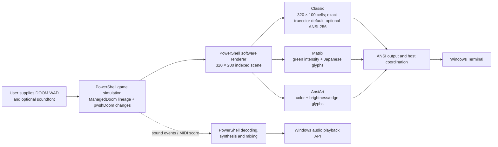
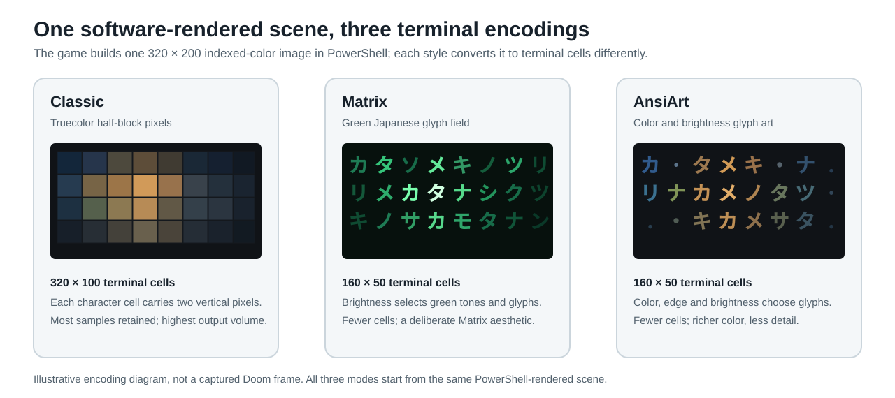
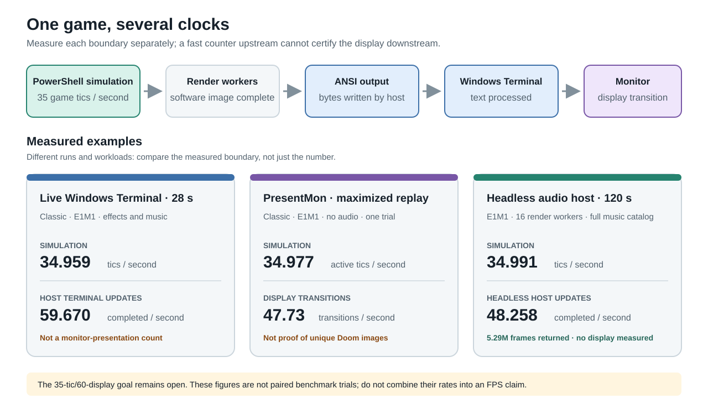

# Doom in PowerShell: how far can a terminal go?

Research article draft · Updated 2026-09-29. Preview.3 is the latest tagged public package; the development handoff R16 is pinned to game source commit `3e0b6308bac9dc152f9ae78fb8f23f70623b36e2`. R16 changes device-audio shutdown only: on normal unpaused exit, it waits up to 250 ms for already-submitted buffers to finish. The candidate passes current-source startup/audio-shutdown checks and a 36-map load/render smoke. Jason's first human attempt reported sprite-visibility issues and an E1M2 chainsaw crash; a focused attack regression now passes, but the complete post-fix Episode 1 route remains pending. This article describes measured progress, not a finished campaign certification.

## The question

Could PowerShell run Doom's game logic and draw its world inside Windows Terminal? The experiment uses a 320×200 Doom image, preserves the game's 35-tic simulation, and targets 60 displayed updates per second. A second goal grew out of it: turn the same world into a green Matrix view with Japanese characters, plus a full-color character-art mode.

The answer is a qualified yes. A real Doom-derived game foundation, renderer, gameplay loop, terminal encoders and audio algorithms now run in PowerShell. The current source passes map-load and rendering smoke checks for all 36 Ultimate Doom maps, and it has focused tests for campaign transitions, menus, saves, boss progression and all three display styles. That is meaningful engine work, but it is not proof that a human can finish every map. The one continuous Episode 1 playthrough, including its secret-map detour and finale, remains the current human test.

## What runs where

PowerShell owns the game and presentation algorithms. Windows Terminal receives their text output and presents it. Its GPU can compose and draw the terminal surface; it does not automatically execute PowerShell's collision, enemy logic, rasterization or ANSI encoding on the GPU. The operating-system and audio APIs provide host services around those algorithms.

The gameplay foundation is an attributed GPL PowerShell translation of ManagedDoom, itself derived from Doom. pwshDoom retains that lineage and adds integration, fixes and a terminal renderer; it is not a clean-room reimplementation. The source history and adopted changes are listed in [`ORIGIN.md`](../src/ManagedDoom/ORIGIN.md).

The three styles trade pixel detail for different looks. Classic uses one terminal cell for two vertically stacked pixels, so its 320×200 image occupies 320 columns by 100 rows. Matrix and AnsiArt reduce that same scene to a 160×50 character field: Matrix maps brightness to green tones, Japanese glyphs and moving highlights; AnsiArt uses color and edge/brightness choices. These modes are intentionally lossy. The project keeps Classic as the visual-fidelity reference.

## Several clocks, not one FPS

The game advances at 35 tics per second. Rendering workers produce images; the host writes ANSI data; Windows Terminal processes those writes; Windows may then present images to the display. A counter at one stage does not establish the rate at a later stage. In particular, a completed console write is not proof that a distinct frame reached the monitor.

The strongest available readings are still workload-specific:

| Run | Observed result | What it does not establish |
| --- | --- | --- |
| 28-second Classic E1M1 host run, with sound effects and music | 34.959 simulation tics/sec; 59.670 completed Terminal updates/sec | The updates were not measured as distinct monitor presentations. One queue-starvation observation occurred after the final music packet; no listener review was made. See [`performance.md`](performance.md#current-source-e1m1-run--september-26-2026). |
| Maximized Classic E1M1 PresentMon sample, no audio | 34.977 active tics/sec; 47.73 display transitions/sec | It was one unpaired replay, ended on E1M1 rather than a completed route, and included a 7.119-second same-map asset reload. It does not certify the target. See [the current pacing record](performance.md). |
| 120-second headless E1M1 host run, with full-catalog music | 34.991 simulation tics/sec; 48.258 completed host updates/sec; all 5,290,740 audio frames returned after crossing the 96-second music loop boundary | Headless host updates are not Terminal or monitor measurements. One mixer block exceeded the packet interval; no active-run queue starvation or audible review was observed. See [`performance.md`](performance.md#two-minute-audio-loaded-headless-e1m1-run--september-28-2026). |
| R16 four-second E1M1 headless run, actual audio device and qualified Episode 1 catalog | 34.728 simulation tics/sec; 36.727 headless render updates/sec; all 186,480 submitted audio frames completed, including 3,780 drained in 68.8 ms at shutdown | No audio/device/cleanup errors, software queue-starvation observations, rebuffering, or canceled frames. A short headless startup/exit check is not sustained audible continuity, Terminal pacing, or displayed FPS. See the [R16 receipt](../results/episode1-current-human-candidate-20260929-r16.json). |
| R16 six-second E1M1 headless run with the 30-entry full-campaign catalog | 34.810 simulation tics/sec; 23.818 headless render updates/sec; all 265,860 submitted audio frames completed | The worker played D_E1M1 only; this does not verify runtime playback of every catalog track, full-campaign continuity, audibility, Terminal output, or display rate. See the [full-catalog receipt](../results/music-campaign-catalog-host-r16-20260929.json). |
| One fixed framebuffer encoded as Classic `Pairs` versus optional `Ansi256` | 666,169 versus 475,310 bytes across 16 strips; ANSI-256 used 28.65% fewer bytes | This compares output volume for identical indexed pixels; ANSI-256 approximates RGB. It is not an encoder-speed or live-pacing result. The one-per-mode live runs were unpaired and inconclusive. See the [Ansi256 receipt](../results/ansi256-runtime-20260929.json). |
| E3M6 headless, full-catalog runtime check | Two 30-second runs reached 33.50 / 34.93 tics/sec on PowerShell 7.6.5 and 27.63 / 28.37 on 7.6.6; a 120-second 7.6.5 run reached 34.37 | The 7.6.6 result is lower in these repeats, but they do not prove the runtime patch caused the difference. Headless host updates are not monitor presentations, and queue polling is not an audible-dropout test. See [the full comparison](performance.md#powershell-runtime-comparison-on-e3m6--september-28-2026). |
| R9 music-catalog open, eleven Episode 1 tracks | Warm-cache reader-open median: 4.665 seconds serial, 2.050 seconds with up to four PowerShell runspaces; all qualification hashes match and 21 focused checks pass | Measures reader initialization only, after the OS file cache is warm; the separate five-second host run is unpaired and does not measure visible playback. See [the R9 measurement](performance.md#open-the-qualified-episode-1-music-catalog-in-parallel--september-29-2026). |
| Fixed 1,200-command E1M3 headless prefix | 30.829 tics/sec; 53.925 completed images/sec; all submitted audio frames returned | Headless image completion is not a display measurement or human playthrough. See [automap performance](automap-discovery-performance.md). |

The machine approaches Doom's 35-tic simulation rate in some runs, but the E3M6 full-catalog repeats vary materially with the recorded PowerShell runtime version. The evidence does not establish why, and no run proves 60 distinct displayed frames/sec. The combined 35-tic/60-display target remains unverified. These runs are not a controlled comparison against another engine.

## A room is not a campaign

The all-map sweep loads each of the 36 Ultimate Doom maps, advances a short simulation, and renders frames. The R16 source freshly loads, idles, and renders all maps, including E1M9. Separate HMP input routes complete E1M1–E1M4 through ordinary exits; transition tests cover the E1M3 secret path, return to E1M4, map-8 boss triggers and finale states. These checks find structural defects quickly, but none substitute for ordinary play across a complete episode.

The R16 human route is:

`E1M1 → E1M2 → E1M3 → E1M9 → E1M4 → E1M5 → E1M6 → E1M7 → E1M8 → Episode 1 finale`

It is intended to cover continuous keyboard play, inventory and map transitions, the secret return, the boss-triggered exit, visible presentation, and sound during a real run. The exact build, controls and finish point are in the [playtest handoff](episode1-playtest.md). The old automated E1M5 continuation ended in player death without exposing a reproducible engine defect; the route was not tuned into a speedrun. The E1M2 chainsaw crash was traced to an unsupported angle comparison; the focused attack regression reaches and damages an imp on the current gameplay source, but Jason has not completed a post-fix full route. The lower-level Techpillar overlap is consistent with classic plane/sprite draw order; the separate pre-placed Gibs-through-wall angle remains unreproduced. The human run is still pending.

Menus, pause, six save slots, load/overwrite confirmations, automap and intermission/finale transitions have focused coverage. Five boss-trigger behaviors pass 97 checks, but trigger correctness is not evidence that ordinary combat reaches those triggers. The distinction between feature tests, route replays and human campaign evidence is retained in the [campaign matrix](campaign-matrix.md).

## Fidelity work has boundaries

The renderer is a substantial PowerShell implementation, not yet an original-executable pixel match. It now follows Doom-style fixed-point plane mapping, integer wall sampling, sprite/weapon patch projection, sector lighting, palette changes and the major HUD layout. One reproduced wall-silhouette leak was clipped; the focused test suppresses the candidate-only BON1 actor pixels at its failing view. A more recent E1M1 screenshot of lower-level Techpillar columns crossing an upper floor was traced to Doom's plane/sprite draw order. Sanglard's discussion of visplanes and masked sprites (pp. 197, 208, 214, 240 and 242) describes the relevant ordering and wall-silhouette clipping; the [reference audit](reference-audit.md) cross-checks that model against the ported renderer. A historical 17-pixel actor-mask difference at E1M1 tic 105 no longer reproduces in the current-source eight-state regression comparison. A later 64-case sweep of the two pre-placed Gibs piles across the two recorded pool camera states found one candidate-only mask pixel; detailed palette and plane data explain it as a background-color disagreement, not a reproduced through-wall leak. The exact angle Jason saw and independent original-executable parity remain unverified ([sweep](../results/episode1-pool-gibs-angle-sweep-20260928.json)).

The adopted PowerShell reference was itself corrected after source inspection found object-equality behavior that skipped Doom's wall-orientation lighting. Comparisons against that reference have improved specific HUD, lighting and projection cases, but broad scene differences remain. The latest eight-state E1M1 actor comparison reports four candidate-only mask-edge pixels at tic 35 and none from tics 70 through 280; that replay does not reproduce the reported Gibs-through-wall view. A separate input-tic-140 audit found 13 reference-only `BON2B0` mask pixels at a column where pwshDoom's recorded background depth is 277 map units nearer than the sprite. This accounts for one narrow comparison difference, not the reported view or original-executable parity ([depth audit](../results/actor-occlusion-depth-audit-human-prefix-tic140-20260928.json)). No independent original Doom executable has been used for a full visual comparison. See the [rendering record](rendering-fidelity.md) for the individual controls and limitations.

## Sound is part of the test

Sound effects are decoded and mixed in PowerShell; Windows APIs handle playback. Music is also synthesized and mixed in PowerShell from the user's IWAD and soundfont. Eleven Episode 1 tracks have local loop qualifications. The full 30-entry Ultimate Doom catalog covers the 27 map-track names, intermission, the Episode 1 finale, and the E3 Bunny finale; actual map-selection callbacks and finale transitions pass 126 checks. On September 28, a 120-second headless E1M1 session crossed its music-loop boundary and returned all 5.29 million audio frames. R16 drains already-submitted Windows audio buffers for up to 250 ms on normal unpaused shutdown; a four-second current-source E1M1 host run drained its final 3,780 frames in 68.8 ms and canceled none. A separate six-second run with the 30-entry catalog completed all 265,860 submitted frames, but selected only D_E1M1. The current reader also passes [15 save/load/new-game audio-worker checks](../results/episode1-save-worker-reader-optimized-20260928.json). Neither WADs nor soundfonts are included in the source package.

The music work proves useful but bounded facts. A loop can be checked through repeated PCM output or a complete normalized synthesizer-state recurrence. Short audio-device checks verify selection and shutdown, not that an entire episode plays without a dropout or sounds good to a listener. All nine Episode 2 and all nine Episode 3 map-track names are qualified; D_BUNNY also has a complete-state loop proof, and finite D_INTRO and D_INTROA scores have reader qualifications. Episode 4 reuses earlier episode tracks. A two-minute E1M1 run crossed one loop seam; one post-final-packet queue observation followed shutdown. Earlier loaded E3M6 trials exposed active software queue starvation. After the PowerShell output-clock fill change, a current-source, 30-second, 16-worker E3M6 run with the 30-track catalog mixed 720 simulation packets plus 104 output-clock blocks with no reported queue-starvation or rebuffer observations, then closed the audio device cleanly. At shutdown, 5,040 of 1,038,240 submitted frames remained in the canceled-tail upper bound. The run also spent 6.769 seconds paused for a same-map reload whose trigger was not isolated, and its active simulation rate was 30.93 tics/sec. This improves the bounded queue evidence; it does not establish uninterrupted audible output, physical-device underrun behavior, acoustic quality, or full-campaign continuity. A listening review and full-campaign audio qualification remain open. Details are in the [music qualification notes](music-preparation.md) and [current E3M6 load receipt](../results/e3m6-realtime-audio-loaded-20260928.json).

## Existing alternatives

“Doom in a terminal” is no longer novel by itself, and the relevant projects take different paths. The [updated survey](existing-implementations.md) was checked against current repository sources on September 28, 2026.

| Project | What it optimizes for | Relationship to this project |
| --- | --- | --- |
| [ManagedDoomPowershell](https://github.com/oleyska/ManagedDoomPowershell) | PowerShell gameplay with a Silk.NET/OpenGL window | Important engine lineage, but not a terminal renderer. Its maintainer reports poor Windows performance and documents known transition/frame-cap limitations. |
| [doom-powershell](https://github.com/nick0451/doom-powershell) | A compact, single-file PowerShell WAD renderer and game | A closer language/display comparison. Its README still lists moving floors, walk-over triggers and sound as unfinished. We have not benchmarked its current source. |
| [terminal-doom-pwsh](https://github.com/spidychoipro/terminal-doom-pwsh) | Original Doom engine in Windows Terminal | PowerShell builds and launches it, but the gameplay and half-block renderer are compiled C. It is outside the all-algorithms-in-PowerShell constraint. |
| [cryptocode/terminal-doom](https://github.com/cryptocode/terminal-doom) | Original graphics and sound in modern terminals | C `doomgeneric` plus a Zig/`libvaxis` frontend and Kitty graphics. Its README reports macOS/Linux testing and says Windows compiles without a compatible local terminal. It is not benchmarked here. |
| [dcouple/terminal-doom](https://github.com/dcouple/terminal-doom) | Shareware Doom in Kitty-protocol terminals | Chocolate Doom in WebAssembly through a local browser; the README targets macOS/Linux, has sound effects but no music, and keeps saves in the session. |

For the narrow requirement “real Doom-derived gameplay in Windows Terminal, with gameplay/rendering/audio algorithms kept in PowerShell,” pwshDoom is the closest complete implementation found in this survey. That makes it the best fit to this experiment's constraint, not the best Doom port overall. The native ports choose compiled engines and protocols that can carry original pixels more directly; they are the sensible choice when broad compatibility, speed or pixel fidelity matters more than keeping algorithms in PowerShell. No equal-workload comparison has established a universal winner.

## What a preview does and does not claim

The public Preview.3 community-test package is source-inclusive and excludes the IWAD, soundfont, compiled engine, generated recordings and research PDF. Its release archive has a per-file hash manifest and a separate SHA-256 checksum; the [publication receipt](../results/preview3-publication-20260928.json) verifies all 537 included file hashes and the uploaded ZIP against a fresh public download. Under PowerShell 7.6.5, the packaged music-reader test passes 22 checks, launcher preflight finds Windows Terminal and all 36 maps in the installed IWAD, and a two-second sound-enabled headless run advances 69 simulation tics and completes 76 host frames with no error or audio-backpressure observation. That short smoke does not report returned audio frames or qualify visible playback, performance or continuity. The current R16 development handoff is pinned in the [candidate receipt](../results/episode1-current-human-candidate-20260929-r16.json); it adds a bounded audio-device shutdown drain and records current-source 7.6.6 checks. Preview.3 itself remains unchanged, and the complete E1 human playthrough remains pending.

Preview.3 is a public community-test build released before the one complete Episode 1 human run. A static license/asset audit of its candidate found the GPL text and third-party notices included, all 206 vendored PowerShell files carrying the upstream GPL terms, and no WADs, soundfonts, media, native binaries or research PDF in the ZIP. The paper still needs the playthrough result and publication-ready illustrations. This is not the end of the roadmap: presentation pacing, visual fidelity, sustained audio, and the wider Ultimate Doom qualification remain open. Doom II follows the Ultimate Doom release; the MyHouse audit follows Doom II. Neither is claimed by this preview.

The current evidence supports a specific conclusion: PowerShell can run a real Doom-derived single-player engine and render it in Windows Terminal, including an intentionally stylized Japanese-glyph Matrix view and color art. The experiment has exposed where the shell/runtime/terminal boundary costs time, how character encodings trade detail for bandwidth, and how much campaign coverage matters beyond a pretty frame. Whether it can deliver the full Ultimate Doom experience at its target pace is still being tested.

### Evidence and reproduction

- [Roadmap and current release gates](roadmap.md)
- [Episode 1 handoff and scope](episode1-playtest.md)
- [Existing implementation survey](existing-implementations.md)
- [Terminal architecture](terminal-architecture.md)
- [Performance evidence](performance.md)
- [Campaign matrix](campaign-matrix.md)
- [Rendering fidelity](rendering-fidelity.md)
- [Audio and music preparation](music-preparation.md)
- [Source lineage and modifications](../src/ManagedDoom/ORIGIN.md)
