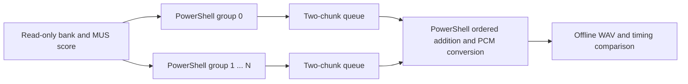

# Bounded PowerShell music workers

This is an offline experiment outside `Start-Doom.ps1`. The game still plays sound effects only. The experiment tests whether the existing dry synthesizer can produce music quickly enough when work is shared among PowerShell runspaces; it does not certify device playback or gameplay performance.

## What is implemented

`MusicGroup.ps1` renders the same 1,260-frame subblocks and every original MUS event boundary as the single synthesizer. Output is accumulated into chunks of twenty subblocks by default: 25,200 stereo frames, about 0.571 seconds at 44.1 kHz. The final chunk is truncated to the requested duration. Changing chunk batching retains those subblock/event boundaries.

The parallel harness starts a fixed runspace pool. Each worker owns a synthesizer and timeline, while prepared bank/sample and score objects are shared read-only. Each producer has a standard .NET blocking queue with capacity two. It can also hold an in-flight chunk; the consumer holds the chunks being combined. Queue payload accounting is therefore separate from total process memory. The offline harness retains the final signed-16 output for comparison; it is not a bounded playback ring yet.



The consumer checks chunk index, first frame and length before combining groups in fixed group-index order. It applies master volume and saturation once. Floating-point addition is not generally order-independent, so each run compares the complete PCM against the original. No bank layers or release tails are dropped to obtain the reported times.

Cancellation interrupts a blocked queue producer. Worker failures complete the queue and propagate to the parent; cleanup stops remaining pipelines and disposes queues and the pool. The first parallel run finished synthesis but failed while attempting to unwrap an already-unwrapped result object. That failure is retained as `music-groups-two-parallel-first.json`; the extra unwrap is removed.

## Partitions and observed results

Channel policies assign all voices on a MUS channel to one worker. `RoundRobin` uses channel number modulo group count. `GreedyNotes` balances positive note-on counts across the entire score, without looking only at the rendered opening. Both preserve channel controller/mono/exclusive behavior naturally, but counts alone are a poor cost estimate when release durations vary.

`RoundRobinNotes` distributes complete positive-velocity note-ons by sequence number. Every worker processes every event, including foreign note-ons, so controllers, sustain, release, exclusive cuts and mono cuts still affect its retained voices. After admission, only the selected worker retains the new note, including all layers. This repeats note setup on every worker but shares the sustained percussion workload. Owned note counts and processed note counts are reported separately.

| Fixture and partition | Serial seconds | Parallel seconds | Observation |
| --- | ---: | ---: | --- |
| Eight seconds, one channel group | 5.438 | — | Exact original WAV |
| Eight seconds, two even/odd channel groups | 5.913 | 7.727 | Opening note counts 4/67; poor balance |
| Eight seconds, two greedy channel groups | 5.602 | 4.556 | Exact same grouped and original WAV |
| Full 98 seconds, two greedy channel groups | — | 140.587 | Voice peaks 9/39; still slower than playback |
| Full 98 seconds, four greedy channel groups | — | 146.408 | Percussion alone peaks at 34 voices |
| Eight seconds, two note groups | 5.807 | 5.055 | Owned notes 36/35; exact original WAV |
| Full 98 seconds, two note groups | — | 113.354 | Voice peaks 23/24; improved balance |
| Full 98 seconds, four note groups | — | 102.723 | Voice peaks 12/12/13/13; merge/PCM costs 14.337 seconds |
| Full 98 seconds, four note groups, function merge | — | 98.512 | Merge/PCM costs 2.003 seconds; still slightly slower than playback |

Reports use the `music-groups-*` names in `results/`. Each successful row preserves the whole relevant WAV, including the score restart in full runs. Full note-group runs retain 2,351 owned notes and 108 aggregate exclusive cuts. The full reference SHA-256 is `989CBD3C9E16782088EB4EF558477AC7A18602897D9390B1E148314B0D2FC530`.

Times include pool/group initialization, producer waits, final mixing and PCM conversion. Bank/score preparation and output writing/hashing/comparison are excluded. All full runs are sequential study workloads; documentation/read-only activity and ordinary system activity remain uncontrolled. These are observations, not repeated paired benchmark results or equal-performance claims for other machines.

Moving the addition loop into a small PowerShell function is a separate measured variant, selected with `-MergeMode Function`. Its eight-second four-worker run observes 4.098 seconds total and 0.206 seconds in merge/PCM, preserving every output sample. A same-source inline control observes 4.434 seconds total and 2.033 seconds in merge/PCM. The full function-merge run observes **98.512 seconds**, including 2.003 seconds in merge/PCM, initialization of 0.106 seconds and first-chunk availability at 0.610 seconds. Producer work overlaps consumer mixing, so the large reduction in merge time does not translate into the same wall-time reduction.

The full function-merge output is local at `local/music-groups-c05d4af1fdc14e57b23c3e69f99697c9/D_E1M1-Parallel-4.wav`, with the exact full reference hash above. Its retrospective startup requirement is 3.043 seconds and whole-process peak working set is 329,515,008 bytes. The result is near playback speed on this finite unpaced fixture, with insufficient demonstrated margin for live gameplay. Further optimization and a paced bounded-consumer test are required before host integration.

## Validation and limits

`Test-MusicGroups.ps1` passes nineteen checks. They cover invalid channel selections, exact manually scheduled output, ignored-channel isolation, chunk metadata, finished reads, batching through score loops, complete layer ownership, cross-worker exclusive and mono cuts, actual queue backpressure, cancellation and error propagation. The tests use synthetic samples and real runspaces, without a playback device.

`music-group-validation.json` passes 164 evidence checks. It verifies all named successful short/full WAVs on disk, exact PCM comparisons, input identity, once-only aggregate note ownership, exclusive-cut totals, frame sequences, fixture voice bounds, current source hashes/parses and retention of the initial reporting failure.

Per-worker voice limits do not yet enforce one global admission limit for arbitrary scores. This stock fixture stays below 256 even when summing all worker peak counts, so that distinction does not affect these measurements. A general host implementation needs an explicit admission policy before claiming equivalent behavior near the limit.

The reported minimum startup delay is retrospective: for every chunk, take its completion time minus its starting audio time, then take the maximum. This asks how much initial delay would have covered that particular unpaced production schedule. It is not a measured device underrun count and does not account for a paced consumer applying backpressure. A real bounded playback ring, pause/resume, session transitions, epoch/reset handling, shutdown and gameplay-load tests remain necessary.

The entire harness process peaks around 270–339 MB in the runs inspected so far; these figures include engine definitions, bank preparation, output arrays and garbage collection behavior. They are not isolated worker allocations. Read the exact report for each run's memory, queue payload bound, initialization time, first-chunk time and per-chunk schedule.

An independent `Measure-MusicStateAccess.ps1` probe shows faster access to typed PowerShell fields than hashtable properties on its synthetic loop. It is retained as a possible later optimization, not applied to the synthesizer or counted as a real music speedup.

## Reproduce

Run from `C:\projects\pwshDoom` with fresh output paths and user-local assets:

```powershell
./scripts/Test-MusicGroups.ps1 -Output local/music-groups-unit.json
./scripts/Render-MusicGroups.ps1 -Output local/music-groups.json -Seconds 98 -Groups 4 -Execution Parallel -GroupPolicy RoundRobinNotes -MergeMode Function -ReferenceReport results/music-e1m1-dry-numeric-loop.json
./scripts/Test-MusicGroupEvidence.ps1 -Output local/music-group-evidence.json
```

The render script accepts `-Wad`, `-SoundFont`, `-Track`, `-Volume`, `-BlocksPerChunk` and a finite timeout. The evidence audit requires the named retained reports and local WAV files. No compiled custom synthesizer, mixer or rendering helper is used.
