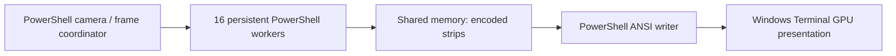

# PowerShell-only rendering toward 320x200 at 60 FPS

Follow-up investigation, 2026-09-10. The user requires engine and rendering algorithms to remain in PowerShell. A C/C# Doom engine, compiled rendering hot loop, or GPU rasterizer does not satisfy that requirement.

**Result:** the new PowerShell process renderer can construct, encode, and write fresh 320x200 E1M1 scene updates at 60 per second in Windows Terminal. Full color is retained. This establishes a renderer throughput path; full gameplay at 60 displayed FPS is still unproven.

## The approach that worked

Use one PowerShell coordinator and 16 persistent PowerShell worker processes. Each worker owns a 20-column strip of the full 320x200 image. It traverses the BSP, renders textures/lighting/sky, and encodes that strip as truecolor ANSI half-block cells. Workers communicate through standard .NET named memory mappings and events. The coordinator writes the completed strips inside one synchronized terminal update.



No custom C#, C, native Doom engine, GPU shader, reduced image resolution, or pre-rendered animation is used. Standard .NET APIs provide arrays, byte copying, clocks, process creation, events, and shared memory. Every timed live update renders a new camera angle. WAD parsing and palette-string caching happen at startup.

Keeping byte arrays out of PowerShell's object pipeline was essential. An early encoder accidentally enumerated every output byte; returning the array as a single object removed that cost. Persistent processes performed better than the tested runspace configurations, including a runspace recheck after the array fix. The underlying cause of the remaining runspace scaling difference was not isolated.

## Measured results

The main comparison uses a continuously rotating E1M1 camera. A 30-second case sweeps 10.5 radians, covering more than one full revolution. It includes walls, floors, ceilings, and sky. It excludes actors, weapons, HUD, input handling, simulation, and audio.

| Measurement | Full-color ANSI |
| --- | ---: |
| Uncapped completed updates, 30 seconds | 97.4/sec |
| Uncapped median construction + write | 9.83 ms |
| Uncapped p95 construction + write | 12.87 ms |
| Precisely paced completed updates, 30 seconds | 1,800; 60.000/sec |
| Paced median / p95 frame-start interval | 16.6666 / 16.6728 ms |
| Paced median / p95 construction + write | 10.16 / 13.14 ms |
| Paced frame work over 16.67 ms | 23 of 1,800 |
| Paced completion-deadline misses | 52 of 1,800 |
| Sum of worker working sets at the end | approximately 2.55 GiB |

Sources: [30-second uncapped and coarse-paced run](../results/process-scene-live-truecolor-30s.json) and [corrected precise pacing](../results/process-scene-live-precise.json). A successful write is still not a unique monitor-visible frame. Average throughput is not a promise that every frame meets its deadline.

The Sleep-based limiter initially hid substantial jitter behind an average of 60 updates/sec: p95 frame-start interval was 27.4 ms, with 461 late completion deadlines. Stopwatch/SpinWait pacing reduced that interval to approximately 16.673 ms at p95. It explicitly consumes part of a coordinator CPU core during the wait. It does not change system timer settings or process priority.

An optional ANSI 256-color mode maps Doom colors to the terminal's fixed color cube and grayscale entries. It preserves 320x200 geometry but approximates colors. Its 30-second precise-paced run also completed 1,800 updates, with median work 9.07 ms, p95 12.03 ms, and 35 late deadlines. The improvement does not justify making color approximation the default. See [the raw comparison](../results/process-scene-live-ansi256.json).

These are active-desktop measurements. Other user workloads were observed and left running. Short cases, one map, one stationary camera position, and no independent presentation telemetry limit the conclusion. Headless eight-heading tests jump abruptly between views and are a different workload from continuous rotation; their timings should not be treated as interchangeable.

## Correctness and source boundaries

The external renderer remains a hash-pinned, user-local dependency from nick0451/doom-powershell. No upstream implementation is vendored. Runtime adaptation changes viewport clipping and makes depth/texture interpolation independent of partition boundaries. It changes some pixels compared with the upstream incremental implementation; do not claim reference-engine fidelity from these tests.

All tested worker counts match the adapted serial renderer pixel-for-pixel across eight headings. Twelve independent ANSI decoder tests cover full color and approximate color, odd dimensions, uneven strip boundaries, and preservation of byte-array type. The earlier tests that found partition mismatches and byte enumeration are retained as failed experiments.

The available UI tool still does not expose the Terminal window for direct visual inspection, and the earlier PresentMon ETW attempt was denied. Console UTF-8 decoding and offline image checks are separate evidence. No physical 60 FPS claim follows from the throughput measurements.

## Other rendering paths

| Path | Assessment under the PowerShell-only requirement |
| --- | --- |
| Truecolor ANSI with persistent processes | Best demonstrated option here. Works in the installed Windows Terminal and preserves Doom palette RGB values. |
| Fixed-palette ANSI | Implemented and tested as an optional bandwidth tradeoff. Approximately one millisecond less frame work in this scene, with color loss. |
| Parallel Sixel encoding | Worth a separate experiment: assemble independently encoded six-row bands into a single Sixel image. Could reduce output bandwidth and avoid a 320-column text grid. The existing single-threaded Sixel encoders were too costly; this parallel variant is not yet implemented. |
| PNG/image protocol in another terminal | A different emulator can accept raster images through an image protocol. Standard .NET compression and base64 could handle image transport while PowerShell renders. Requires a new end-to-end benchmark; no performance claim is made. |
| Changed-cell output | May reduce static HUD/menu traffic. Camera motion can change most of the scene, so it cannot be the only strategy for meeting the frame budget. Not implemented here. |

Windows Terminal's [Kitty graphics request](https://github.com/microsoft/terminal/issues/8389) remains open in the inspected primary source. Kitty's [protocol](https://github.com/kovidgoyal/kitty/blob/master/docs/graphics-protocol.rst) supports raw RGB/RGBA and PNG. WezTerm documents [Windows availability](https://wezterm.org/install/windows.html) and [inline images and palette operations](https://wezterm.org/escape-sequences.html). These alternatives do not automatically accelerate the PowerShell rasterizer, and none was installed for this follow-up.

## From scene renderer to playable Doom

Keep the simulation and display rates separate. Original Doom advances game state at [35 tics/sec](https://github.com/id-Software/DOOM/blob/master/linuxdoom-1.10/doomdef.h). A PowerShell game process can publish complete state snapshots at that rate; the rendering coordinator can interpolate camera/actor transforms and request frames at 60. Rendering the same state more frequently must not speed up gameplay.

The next integration work is concrete: add actor/weapon/HUD rendering within the strip ownership rules; publish door, sector, lighting, and actor state consistently; connect input and a faithful PowerShell simulation; then measure combat and more demanding maps. Current worker worlds are static after load except for the camera angle, so they cannot yet reflect gameplay state changes. A licensed engine foundation or upstream licensing agreement is required before adopting implementation code into a distributable port.

Leave rendering, simulation, output, and presentation as separate measurements. The demonstrated scene work leaves several milliseconds of a 16.67 ms budget in typical frames, but its overruns and untested gameplay costs must remain visible. The outcome is a credible implementation direction with runnable code, not a finished Doom port.

## Run the demonstration

From PowerShell 7 in this repository:

```powershell
$wad = 'C:\Program Files (x86)\Steam\steamapps\common\Ultimate Doom\base\DOOM.WAD'
.\scripts\Start-BenchmarkWindow.ps1 -ProcessScene -Workers 16 -Seconds 30 -PacedOnly -DoomWad $wad -Output .\local\my-process-run.json
# Wait for the finite benchmark window to finish, then remove its profile.
.\scripts\Remove-BenchmarkProfile.ps1
```

This launches a geometry demonstration and timing run, not an interactive game. Omit `-PacedOnly` to run an uncapped case first. Add `-ColorMode Ansi256` to test color approximation. The original pinned external source must already be present; see [setup instructions](reproduce.md).

For headless worker comparisons, invoke `Measure-ProcessScene.ps1` or `Measure-ParallelScene.ps1` from PowerShell using `-WorkerCounts @(1,2,4,8,16)` and a fresh output filename. Do not pass that array as a comma-separated native `pwsh -File` argument. Run `Test-AnsiStrips.ps1` to verify strip composition without launching Terminal.

## Matrix transforms follow-up

The user's Matrix module reference prompted a coordinate-only experiment. Direct Matrix3x2/Vector2 calls took about 2.13 ms to transform all 470 E1M1 vertices with cached inputs, versus 0.028 ms for scalar relative-coordinate arithmetic in the same follow-up run. Explicitly typing matrix/result locals did not improve that outcome. These timings exclude rendering and output and do not measure the Matrix module itself. Keep scalar camera math in the current renderer; transformed-vertex reuse remains an untested optimization. The [ledger](ledger.md#2026-09-10--user-supplied-matrix-transforms-lead) records the source inspection, complete comparisons, precision checks, and reproducible experiment.
